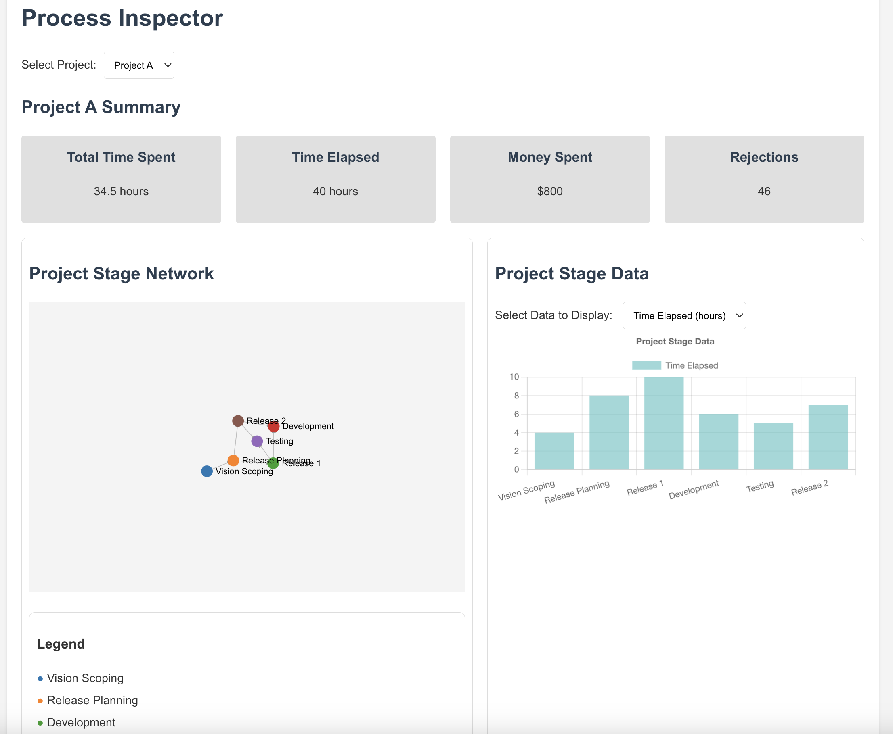

# Process Inspector

A visualization tool for project processes and stages, built with React and Express.

## Features

- Interactive visualization of project stages and relationships
- Network graph showing stage dependencies
- Project summary statistics
- Multiple project support
- Real-time data updates ... *assuming data is fed in*

---




## Project Structure

```
process-inspector/
├── client/                 # React frontend
│   ├── src/
│   │   ├── components/    # React components
│   │   └── services/      # API services
│   └── public/            # Static assets
├── server/                # Express backend
│   ├── index.js          # Server entry point
│   └── tests/            # Server tests
└── data/                 # Application data
    └── projects.json     # Project data store
```

## Prerequisites

- Node.js (v14 or higher)
- npm (v6 or higher)

## Installation

1. Clone the repository:
```bash
git clone <https://github.com/hsb3/operational-stats-visualizer>
cd operational-stats-visualizer
```

2. Install dependencies:
```bash
# Install server dependencies
cd server
npm install

# Install client dependencies
cd ../client
npm install
```

## Configuration

The application uses the following default ports:
- Backend API: 3002
- Frontend Development Server: 3003

You can modify these ports by setting the PORT environment variable:
```bash
# For the server
PORT=3002 npm start

# For the client
PORT=3003 npm start
```

## Running the Application

1. Start the server:
```bash
cd server
PORT=3002 npm start
```

2. In a new terminal, start the client:
```bash
cd client
PORT=3003 npm start
```

3. Access the application at http://localhost:3003

## Development

- The client development server includes hot reloading
- API endpoints are proxied to the backend server
- Backend changes require server restart

## Testing

Run tests for both client and server:
```bash
# Server tests
cd server
npm test

# Client tests
cd client
npm test
```

## API Endpoints

- GET `/api/projects` - List all projects
- GET `/api/projects/:id` - Get specific project
- POST `/api/projects` - Create new project

